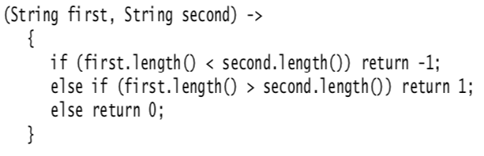
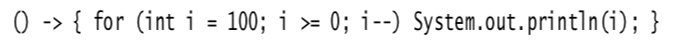
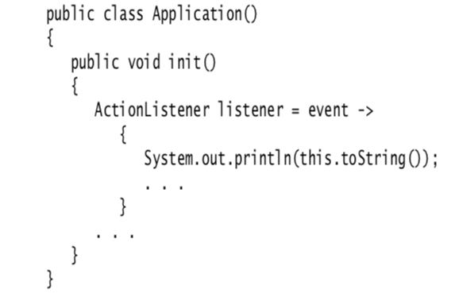
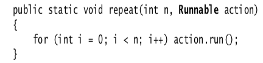
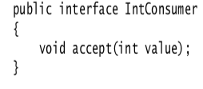
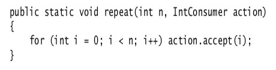
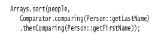

# Interfaces:  

## The Interface Concept:  
* in Java, an interface is not a class but a set of requirements for the classes that want to conform to the interface.  
* any class that implements an interface is required to have the interface method.  
* all methods of an interface are automatically public, so it is not necessary to supply the keyword public when declaring a method in an interface.  
* interfaces can have multiple methods and can declare constants, but interfaces can never have instance fields.  
  + supplying instance fields and methods that operate on them is the job of the class that implements the interface.  

###### Declaring A Class That Implements An Interface:  
1. Declare that your class intends to implement the given interface.  
   1. *class Employee **implements** Comparable`<Employee`>*  
2. Supply definitions for all methods in the interface.  
   1. *public int compareTo(Employee other)  
        {
            Employee other = (Employee) otherObject;
            return Double.compare(salary, other.salary);
        }  
* the reason interfaces are necessary in Java is because it is a strongly typed language.  
###### Properties Of Interfaces:  
* interfaces are not classes, so you can never us the new operator to instantiate an interface.  
* just as you can use *instanceof* to check whether an object is of a specifi class, you can also use *instanceof* to check whether an object implements an interface.  
* just as you can build hierarchies of classes, you can extend interfaces. 
  + this allows for multiple chains of interfaces that go from a greater degree of generality to a greater degree of specialization.  
* while each class can have only one superclass, classes can implement *multiple* interfaces.  

###### Interfaces And Abstract Classes:  
* because a class can only extend a single class, interfaces should be used to express a generic property becuase a class can implement as many interfaces as it likes.  
  + interfaces allow for multiple inheritances.  

###### Static Methods: 
* when you implement your own interfaces, there is no reason to provide a separate companion class for utility methods.  

###### Default Methods:  
* you can supply a *default* implementation for any interface method by tagging such a method with the *default* modifier.  
    *public interface Comparable<T>
    {
            **(default** int compareTo(T other)  { return 0; }  
                 // By default, all elements are the same
            }  
###### Resolving Default Method Conflicts:  
If a method is defined as a default method in one interface and then again as a method of a suplerclass or another method:  
1. Superclasses wins and defualt interface methods are ignored.  
2. Interface clash. If two interface methods have the same name and parameter types (default or not) you must resolve the conflict by overriding that method.  
###### Lambda Expressions:  
* a lambda expression is a block of code that you can pass around so it can be executed later, once or multiple times.  

###### Comparator Example:  
If you want to sort strings by length instead of the default dictionary order, you pass a Comparator object to the sort method:  

  
* the *compare* method is called right away. Instead, the *sort* method keeps calling the *compare* method, rearranging the elements if they are out of order, until the array is sorted.  
* you give the *sort* method a snippet of code needed to compare the elements, and that code is implemented into the rest of the sorting logic.  

In this example, a block of code waspassed to a *sort* method and that code was called at some later time.  

###### The Syntax Of Lambda Expressions:  
Lambda expressions are simply a block of code, together with the specification of any variables that must be passed to the code.  

In the comparator example above, we pass the following code that checks whether one string is shorter than another:
* *(first.length() - second.length())*  

This can be rewritten as a lambda expression in the following format:  
* *(string first, String second)
  -> first.length() - second.length()*  

If a code carries out a computation that doesn't fit in a single expression, write it exactly like you would have written a method:
  

If a lambda expression has no parameters, you still supply empty parentheses, just as with a parameterless method:  
  

If the parameter types of a lambda expression can be inferred, you can omit them:  
  

###### Functional Interfaces:  
You can supply a lambda expression whenever an object of an interface with a single abstract method is expected.  
* such an interface is called a functional interface.  

To demonstrate the conversion to a functional interface, consider the *Arrays.sort* method. Its second paramter requires an instance of *comparator*, an interface with a single method. Simply supply a lambda:  
  
* It is best to think of lambda expressions as a function, not an object, and to accept that it can be passed to a functional interface.  
  + this conversion to interfaces is what makes lambda expressions so compelling. The syntax is short and simple.  
  + in fact, conversion to a functional interface is the *only* thing that you can do with a lambda expression in Java.  

You can't assign a lambda expression to a variable of type Objec because Object is not a functional interface.  
* however, you can assign a lambda expression in one of the generic functional interfaces in the *java.util.function* package.  

A particularly usefule interface in the *java.util.function* package is **Predicate**:  
  

The *ArrayList* class has a *removeIf* method whose parameter is a *Predicate*.  
* it is specifically designed to pass a lambda expression. For example, the following statement removes all null values from an array list:  
    + *list.removeIf(e -> e == null);*  

###### Method References:  
Lambda Expression Example:
* Timer t = new Timer(1000, event -> System.out.println(event));  

Method Reference Example:  
* Timer t = new Timer(1000, **System.out::println**);  

Another Method Reference Example:  
* Arrays.sort(strings, String::compareToIgnoreCase)  

As you can see from these examples, the *::* operator separates the method name from the name of an object or class:  

There are three principal cases:  
* object :: *instanceMethod* - *System.out::println* == x -> *System.out.println(x)* 
* Class :: *static method* - *Math::pow* == (x, y) -> *Math.pow(x, y)*
* Class :: *instanceMethod* - *String::compareToIgnoreCase* == *(x, y) -> x.compareToIgnoreCase(y)*

In the first two cases, the method reference is equivalent to a lambda expression that supplies the parameters of the method.  

In the third case, the first parameter becomes the target of the method.  

You can also capture the *this* parameter in a method reference:  
* *this::equals* == x -> *this.equals(x)*  

Or capture the *super* parameter:  
* super:: *instanceMethod*  

###### Constructor References:  
* constructor references are just like method references, except that the name of the method is *new*.  
    + Person::new is a refence to a *Person* constructor.

Constructor references with array types:
* int[]::new is a constructor reference with one parameter: the length of the array.  
    + it is equivalent to the lambda expression x -> new int[x].  

Array constructor references are useful to overcome a limitation of Java. It is not possible to construct an array of a generic type *T*.  
* the expression *new T[n]* is an error since it would be erased to *new Object[n]*.  
  + the *Stream* interface has a *toArray* method that returns an Object array:
    + Object[] people = stream.toArray();  

This result is unsatisfactory because the user wants an array of references to *Person*, not references to *Object*.  
* The stream library solves that problem with constructor references:  
  * Pass *Person[]::new* to the *toArray* method: 
    * Person[] people = stream.toArray(Person[] :: new);  

The *toArray* method invokes this constructor to obtain an array of the correct type, then fills and returns the array.  

###### Variable Scope:  
Lambda expressions can capture the value of a variable in the enclosing scope.  
* to ensure that the captured value is well-defined, you can only reference variables whose value doesn't change.  
* the rule is that any captured variable in a lambda expression must be *effectively final*.  
  * an effectively final variable is a variable that is never assigned a new value after it has been initialized.  

The body of a lambda expression has *the same scope as a nested block*. 
* the same rules for name conflicts and shadowing apply.  
* it is illegal to declare a parameter or a local variable in the lambda that has the same name as a local variable.  
* inside a method, you can't have two local variables with the same name, and therefore, you can't introduce such variables in a lambda expression either.  
* when you use the *this* keyword in a lambda expression, you refer to the *this* parameter of the method that creates the lambda.  

  
* the expression *this.toString()* calls the *toString* method of the *Application* object, *not* the *ActionListener* instance.  
  * there is nothing special about the use of *this* in a lambda expression. The scope of the lambda expression is nested inside the *init* method, and *this* has the same meaning anywhere in that method.  

###### Procssing Lambda Expressions: 
The point of using lambdas is *deferred execution*. If you wanted to execute some code right now, you'd do that without wrapping it inside a lambda.  

There are many reasons for executing code later, such as:  
* running code in a separate thread  
* running the code multiple times  
* running the code at the right point in an algorithm (for example, the comparison operation in sorting)  
* running the code when something happens (a button was clicked, data has arried, and so on)  
* running the code only when necessary  

Suppose you want to repeat an action *n* number of times. The action and the count are passed to a *repeat* method:  
* repeat(10, () -> System.out.println("Hello, World"));  

To accept the lambda, we need to pick a functional interface.  In this case, we can use the *Runnable* interface:  

  
* note that the body of the lambda expression is executed when *action.run()* is called.  

A more sophisticated example would be to tell the action in which iteration it occurs. For that, we need to pick a functional interface that has a method with an *int* parameter and a *void* return.
* the standard interface for processing *int* values is the *IntConsumer* interface;  
  
  

Below is the improved version of the *repeat* method: 

  
And here is how you call it:  

The below table lists the most important functional interfaces:  
  

The below table lists Functional Interfaces for Primitive Types:  
  
* it is a good idea to use an interface from the above tables whenever possible.  
* most of the standard functional interfaces have nonabstract methods for producing or combining functions  
  * for example, *Predicate.isEqual(a)* is the same as *a::equals*, but also works if *a* is null.  
    * default methods for combining predicates are *and, or*, and *negate*  
    * for example, *Predicate.isEqual(a).or(Predicate.isEqual(b)) is the same as *x ->a.equals(x)* || *b.equals(x)*.  

If you design your own interface with a single abstract method, you can tag it with the **@FunctionalInterface** annotation.  
* this has two advantages:  
  * the compiler gives an error message if you accidentally add another nonabstract method.  
  * the javadoc page includes a statement that your interface is a functional interface.  

* it is not required to use the annotation because any interface with a single abstract method is, by definition, a functional interface. But using the *@FunctionalInterface* is a good idea.  

###### More About Comparators:  
The *Comparator* interface has a number of convenient static methods for creating comparators. These methods are intended to be used with lambda expressions or method references.  

The static *comparing* method takes a "key extractor" function that maps a type *T* to a comparable type (such as *String*).  
* the function is applied to the objects to be compared, and the comparison is then made on the returned keys.  

For example, let's say you have an array of *Person* objects. Here is how you can sort them by name:  
* *Arrays.sort(people, Comparator.comparing(Person::getName))*;

This is certainly much easier than implementing a *Comparator* by hand, and the code is clearer since it is obvious that we want to compare people by name.  

You can chain comparators with the *thenComparing* method for breaking ties. For example: 
  
* if two people have the same last name, then the second comparator is used.  

There are a few variations of these methods. You can specify a comparator to be used for the keys that the *comparing* and *thenComparing* methods extract.  

For example, here we are sorting people by the length of their names:  

  

Moreover, both the *comparing* and *thenComparing* methods have variants that avoid boxing of *int*, *long*, or *double* values.  

An easier way of producing the preceeding operation would be:  
  

The *nullsFirst* and *nullsLast* adapters take an existing comparator and modify it so that it doesn't throw an exectpion when encountering *null* values but ranks them as smaller or larger than regular values.  

For example, suppose *getMiddleName* returns a *null* when a person has no middle name. You can use *Comparator.comparing(Person::getMiddleName(), Comparator.nuulsFirst(...))*.

