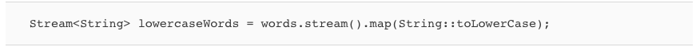
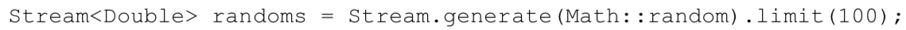
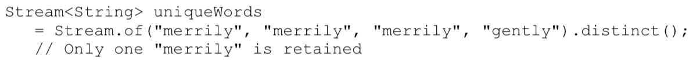
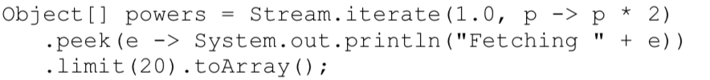

# Streams:  
###### From Iterating To Stream Operations:  
When you process a collection, you usually iterate over its elements and do some work with each of them.  

A Stream seems superficially similar to a collection, allowing you to transform and retrieve data. But there are significant differences:  
1. A stream does not store its elements. They may be stored in an underlying collection or generated on demand.  
2. Stream operations don't mutate their source. For example, the filter method does not remove elements from a stream, but yields a new stream in which they are not present.  
3. Stream operations are *lazy* when posible. This means they are not executed until their result is needed. For example, if you only ask for the first five long words instad of all, the filter method will stop filtering after the fifth match. As a consequence, you can even have infinite streams.  

The stream pipeline of operation is set up in three stages:  
1. Create a stream.
2. Specify the *intermediate operations* for transforming the initial stream into others, possibly in multiple steps.
3. Apply a *terminal operation* to produce a result. This operation forces the execution of the lazy operations that precede it. Afterwards, the stream can no longer be used.  

###### java.util.stream.Stream<T>:  
* Stream<T> filter(Predicate<? super T> p)  
  * yields a stream containing all elements of this stream fulfilling p.  
* long count()  
  * yields the number of elements of this stram. This is a terminal operation.

###### java.util.Collections<E>:  
* default Stream<E> stream()  
* default Stream<E> parallelStream()  
  * yields a sequential or parallel stream of the elements in this collection.  

#### Stream Creation:  
###### Creating Streams From Arrays:  
* Stream<String> words = Stream.of(contents.split("\\PL+"));  // split returns a String[] array  
  * this method has a varargs parameter, so you can construct a stream from any number of arguments:  
  * Stream<String> song = Stream.of("gently", "down", "the", "stream");  
* Use Arrays.stream(array, from, to) to make a stream from a part of an array.  
* To make a stream with no elements, us the static Stream.empty method:
  * Stream<String> silence = Stream.empty();  // Generic type <String> is inferred; same as Stream.<String>empty()  

###### Creating Infinite Streams:  
* The *generate* method takes a function with no arguments(or, technically, an object of the *Supplier<T>* interface*).  
  * Whenever a stream value is needed, that function is called to produce a value. You can get a stream of constant values by:  
    * Stream<String> echos = Stream.generate(() -> "Echo");  
  * or a stream of random numbers by:  
    * Stream<Double> randoms = Stream.generate(Math::random);  
* To produce sequences such as 0 1 2 3 . . ., use the *iterate* method instead.
  * It takes a "seed" value and a function (technically, a UnaryOperator<T>) and repeatedly applies the function to the previous result. For example:  
    * Stream<BigInteger> integers = Stream.iterate(BigInteger.ZERO, n -> n.add(BigInteger.One));
      * The first element in the sequence is the seed BigInteger.ZERO. The second element is f(seed) which yields 1 (as a big integer). The next element is f(f(seed)) which yields 2, and so on.  
* To produce a finite stream instead, add a predicate that specifies when the iteration should finish:  
*   
  * As soon as the predicate rejects an iteratively generated value, the stream ends.  
* The *Stream.ofNullable* method makes a really short stream from an object.  
  * The stream has length 0 if the object is *null* or length 1 otherwise, containing just the object.  
    * This is motly useful in conjunction with  *flatMap*.  

Its very important that you don't modify the collection backing a stream while carrying out a stream operation. Remember that streams don't collect their data -the data is always in a separate collection. If you modify that collection, the outcome of the stream operations becomes undefined.  
* The JDK documentation refers to this requirement as *noninterference*.  
* To be exact, since intermediate stream operations are lazy, it is possible to mutate the collection up to the point where the terminal operation executes.  

###### java.util.Spliterators  
* static <T> Spliterators<T> spliteratorUnknownSize(Iterator<? extends T> iterator, int characteristics)  
  * turns an iterator into a splittable iterator of unknown size with the given characteristics (a bit pattern containing constants such as Spliterator.ORDERED).  
  
###### java.util.Arrays  
* static <T> Stream<T> stream(T[] array, int startInclusive, int endExclusive)  
  * yields a stream whose elements are the specified range of the array.  

###### java.util.regex.Pattern  
* Stream <String> splitAsStream(CharSequence input)  
  * yields a stream whose elements are the parts of the input that are deliminated by this pattern.  

###### java.util.function.Suppliers<T>  
* T get()  
  * supplies a value.  

##### The *Filter*, *Map*, and *FlatMap* Methods:  
A stream transformation produces a stream whose elements are derived from those of another stream.
###### Filter:
The filter transformation yields a new stream with those elements that match a certain condition. 

Here, we transform a stream of strings into another stream containing only long words:  
  
* The argument of filter is a Predicate<T> - that is, a function from T to boolean.  

###### Map:  
Often, you want to transform the values in a stream in some way. Use the map method and pass the function that carries out the transformation.  

For example, you can transform all words to lowercase like this:  
  
* Here, we used map with a method reference. Often, you will use a lambda expression instead:  
  
* The resulting stream contains the first letter of each word.  
  * When you use *map*, a function is applied to each element, and the result is a new stream with the results.

Now, suppose you have a function that returns not just one value but a stream of values:  
  
* For example *letters("boat")* is the stream *["b", "o", "a", "t"]*. 
  * You can implement this method much more elegantly using the *IntStream.range* method.  

Suppose you map the *letters* method on a stream of strings"  
  
* You will get a stream like this:  
  

You can flatten it out to a stream of letters using the **flatMap** method instead of *map* method:  

[. . . "y", "o", "u", "r", "b", "o", "a", "t", . . .]]

  
* You will find a *flatMap* method in classes other than streams. It is a general concept in computer science.  

##### Extracting Substreams and Concatenating Streams:  
###### Stream.limit(n):  
The call stream.limit(n) returns a new stream that ends after *n* elements (or when the original stream ends, if it is shorter).  
* This method is particularly useful for cutting infinite streams down to size. For example:  
  
* This yields a stream with 100 random numbers.

###### Stream.skip(n):  
The call stream.skip(n) does the exact oposit of stream.limit(n). It discards the first *n* elements.
* This method is handy when splitting text into words since, due to the way the *split* method works, the first elment is an unwanted empty string.
* We can make it going away by calling *skip*.  
   

###### Stream.concat(String a, String b);  
    
* Of course the first stream should not be infinite - otherwise the second will never get a chance.  

##### Other Stream Transformations:  
###### .distinct:  
The *distinct* method returns a stream that yields elements from the original stream, in the same order, except that duplicates are suppressed.  
  

###### Sorting Streams:  
There are several variations of the *sorted* method. 
1. One works for streams of *Comparable* elements.
2. The other accepts a *Comparator*.

Here we sort strings so that the longest ones come first:  
  

As with all stream transformations, the *sorted* method yields a new stream whose elements are the elements of the original stream in sorted order.  

##### Peek Method:  
The *peek* method yields another stream with the same elements as the original, but a function is invoked every time an element is retrieved.
* This is handy for debugging: 

  
* In this example, a message is printed when an element is actually accessed. This way you can verify that the infinite stream returned by *iterate* is processed lazily.  

##### Simple Reductions:  
Reductions are *terminal operations*. 

