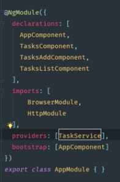

### Angular 4 Java Developers Task Application Notes:  

#### Setting Up H2 Console For Browser Access:  
1. In applications.property file, enter:  
   * spring.datasource.name=tasks
   * spring.jpa.show-sql=true
   * spring.h2.console.enabled=true
   * spring.h2.console.path=/h2-console  

2. Run Server: 
   * Go to browser and enter localhost:8080/h2-console  

3. Change JDBC URL:  
   * In window displayed in browser, change JDBC URL to jdbc:h2:mem:tasks (plural version of entity name) 

#### Create Angular MVC Pattern:  
##### Create Model Component:
1. Create a task.model.ts file for your entity.
   * add fields and constructor to match your Spring entity class.  

 

2. Import task.model.ts to tasks.list.component.ts.  
     * Import file.  
    * Initialize an array of tasks.  
    * Optionally set some tasks up to test by creating new tasks in the ngOnInit() method. 
    * Add a method to getDueDate
      * Add method onTaskChange(event, task)  
      * This method will be completed later, nothing will happen until logic is added.  

  

3. Update tasks-list.component.html to take the tasks using Bootstrap.  
   * Create *ngFor to loop through list of tasks. 
   * Add checkboxes and setup input so that checkboxes can be checked off as completed.  
   * Add a class block to display whether or not task is completed.  
   * Add a class block to display the due date using the getDueDateLable(task) method.  
  
  
Display in brower is updated.
  

Next we will create the service class so that we can remove the status data we entered in the ngOnInit() method to temporarily populate our checklist.  

##### Create Service Component:  
The service class will reach out to the Spring Boot Application to get the data.  

1. Create task.service.ts file.  
   * Export class.
   * Insert dependency injection by creating a constructor that takes takes an Http component as a parameter.  
     * Must add @Injectable decorator anytime a dependency is injected.  
     * Create a getTasks() method that reaches out to our API endpoint.  
     * Pull in map from rxjs library that excepts a response as an objservable. 
   
2. Go to tasks-list.component.ts file.  
   * Import TaskService file.  
   * Create a constructor that takes TaskService in its parameter.  
   * Remove temporary data from ngOnInit() method and replace with taskService.getTasks()  
     * Chain .subscribe() to the get method, which will take an array of tasks that it receives from the server in it's paramater.
     * Finally, log any errors to the console.  

  

3. Go to app.module.ts file.  
   * Import TaskService.
   * Add TaskService as a provider. 
   
 

4. Create a () proxy-conf.json file:  
   * Set API to http://localhost:8080 so that the application can reach Spring Boot's endpoints.  

  

5. Change the "start" line in the package.json file:  
   * Pass in the newly created proxy.conf file to "ng serve".
   * *Going forward, start the frontend server by calling "npm start", instead of "ng serve".*  

  

Any time your are working with two local hosts like we are here, we need to complete steps 4 and 5. 

Adding localhost:8080 directly to the get task method instead of completing steps 4 & 5 will result in a "cross origin resource sharing" (CORS) issues.
 

