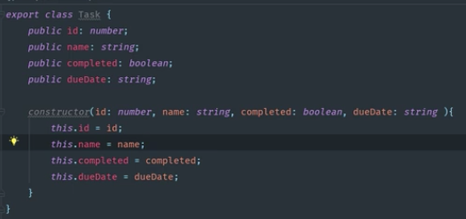
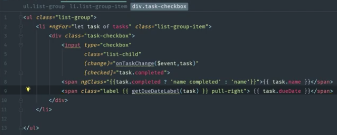

### Angular 4 Java Developers Task Application Notes:  

##### Setting Up H2 Console:  
In applications.property file, enter:  
* spring.datasource.name=tasks
* spring.jpa.show-sql=true
* spring.h2.console.enabled=true
* spring.h2.console.path=/h2-console  

After running server, go to browser and enter:  
* localhost:8080/h2-console  

Change JDBC URL To:  
* jdbc:h2:mem:tasks (plural version of entity name) 

##### Create Angular MVC Pattern:  
###### Create Model Component:
1. Create a task.model.ts file for your entity.
   * add fields and constructor to match your Spring entity class.  

 

2. Import task.model.ts to tasks.list.component.ts.  
     * Import file.  
    * Initialize an array of tasks.  
    * Optionally set some tasks up to test by creating new tasks in the ngOnInit() method. 
    * Add a method to getDueDate
      * Add method onTaskChange(event, task)  
      * This method will be completed later, nothing will happen until logic is added.  

  

3. Update tasks-list.component.html to take the tasks using Bootstrap.  
   * Create *ngFor to loop through list of tasks. 
   * Add checkboxes and setup input so that checkboxes can be checked off as completed.  
   * Add a class block to display whether or not task is completed.  
   * Add a class block to display the due date using the getDueDateLable(task) method.  
  
  
Display in brower is updated.
  

##### Angular Service Layer:  
1. ###### create a () proxy-conf.json file:  
This code will proxy all requests over to spring boot  
  >\{
    "/api"; \{
        "target": "http://localhost:8080",
        "secure": false
    }  
}
2. ###### Change "start" line in package.json file:  
This code will pass in the proxy.conf file to "ng serve".  
> "start": "ng serve --proxy-config proxy-conf.json"  
* Instead of calling "ng serve", you now need to call "npm start".  

