# Angular 4 Java Developers Task Application Notes:  
   

# Setting Up Spring Boot:

### Task Domain:  
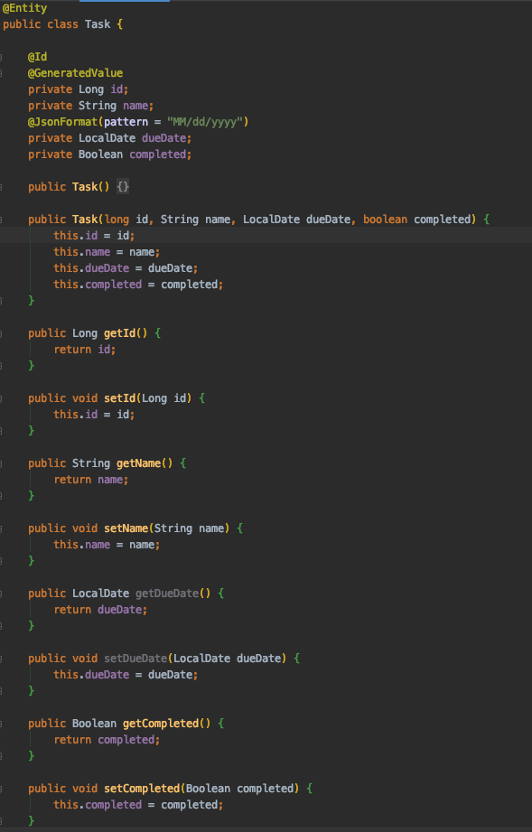  

___  

## Task Controller:  
  

___  

## Task Repository:  
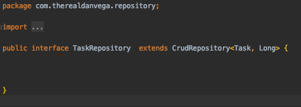  

___  

## Task Service Interface: 
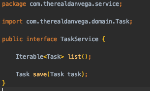  

___  

## Task Service Implementation:  
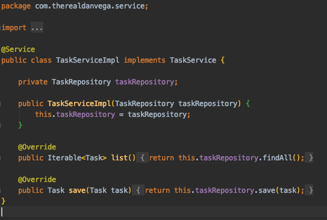  

___   

## Application.Properties Folder:  
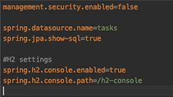  
     * These settings allow the H2 console to be viewed from the browser.  
     * To view the console, run the server and enter localhost:8080/h2-console.  
     * In the window that is displayed in the broswer, change the JDBC URL to jdbc:h2:mem:tasks (plural version of entity object)  

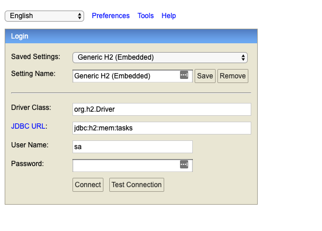  

___  

   
   
   

# Setting Up Angular:

 
## Angular CLI (Command Line Interface):  
1. ### Install Angular CLI  
   * Enter "npm install -g @angular/cli" in terminal.  
___ 
2. ### Enter "ng new frontend" to create Angular project folders and files.  
  
___ 
   

## Create Angular Components:  
The main app.component files that are automatically installed when the Angular project is created are used for sections like navigation bar, footer, side bars, etc.  

We will create nested components inside the apps folder to hold our task application.  

1. ### Create tasks component:  
     * cd into the 'app folder'.
     * enter 'ng generate component tasks' or shorthand version 'ng g c tasks' 
___   
2. ### Create tasks-add component subfolder inside tasks:  
     * enter 'ng g c /tasks/ tasks-add'.  
___  
3. ### Create tasks-list component subfolder inside tasks:  
     * enter 'ng g c /tasks/ tasks-list'.  

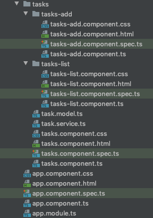  
     
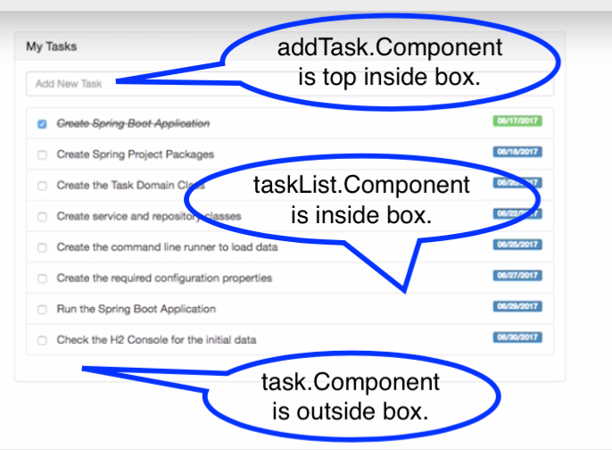  

   

____  
   

## Add Bootstrap To Project:  
1. ### Install Bootstrap:  
   * cd into frontend folder.
   * enter 'npm install --save bootstrap' to save it locally.  
___  

2. ### Tell Angular start using bootstrap:  
   * Got to angular.json folder.  
   * In "styles" array, reference the new bootstrap file.  
     * /node_modules/bootstrap/dist/css/bootstrap.min.css"  
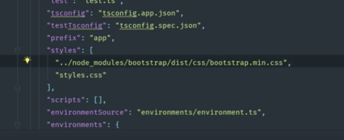  
___  

## Buildout Components:  
1. ### Create container in main app.component.html to hold tasks.component:  
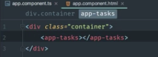  
___  

2. ## Create containers in tasks.component to hold add-tasks and list-tasks component:  

  
___  

3. ## Add starter input.form-control to tasks-add component:  
   * input.form-control is a bootstrap feature that will allow a user to input new tasks in the app. 
   * This feature will updated later in the tutorial.  
 
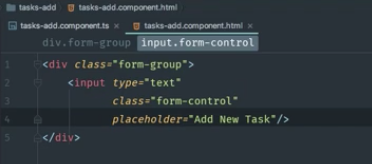  
___  

4. ## Setup tasks-list.component.html:  
   * li.list-group-item is a bootstrap feature will create the list of tasks for the app.  
     * The list below is in place to show that the layout is formatted correctly. This page will be updated once we create our task model in the next section.  

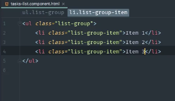  
   
___  

## Create Angular MVC Pattern:  
  
   

## Create Model Component:  

1. ##  Create a task.model.ts file for your entity.  
   * add fields and constructor to match your Spring entity class.  

     
   
___  

2. ## Import task.model.ts to tasks.list.component.ts.    
     * Import file.  
    * Initialize an array of tasks.  
    * Optionally set some tasks up to test by creating new tasks in the ngOnInit() method. 
    * Add a method to getDueDate
    * Add method onTaskChange($event, task)  
      * The logic for this method will be added when we complete the task.service.ts.    

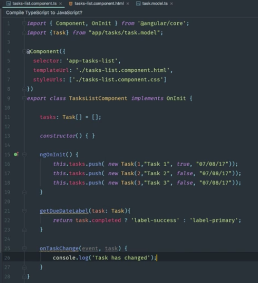      
___  

3. ## Update tasks-list.component.html to dispaly the tasks using Bootstrap.    
   * Create *ngFor to loop through list of tasks. 
   * Add checkboxes and setup input so that checkboxes can be checked off as completed.  
   * Add a class block to display whether or not task is completed.  
   * Add a class block to display the due date using the getDueDateLable(task) method.    

   

Display in brower is updated.  

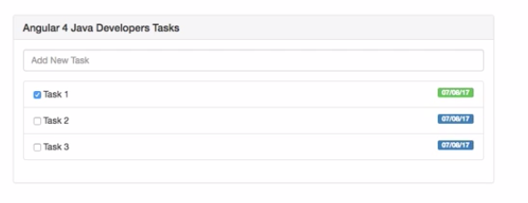      

Next create the service class so the static data that was entered in the *ngOnInit()* method to temporarily populate our checklist can be removed.  
   
___  
   

## Create Service Component:  
The service class will reach out to the Spring Boot Application to get the data.  

1. ### Create task.service.ts file to hold CRUD Operations.    
   * Export class.
   * Insert dependency injection by creating a constructor that takes takes an Http component as a parameter.  
   * Must add @Injectable decorator anytime a dependency is injected.  

___  
2. ### Create a *getTasks()* method and connect proxy to Spring Boot API endpoints.  
   1. #### In taskService.ts file, create a getTasks() method.  
      * Pull in map from rxjs library that excepts a response as an objservable for the *getTasks()* method.  
   2. #### In the app.module.ts, add TaskService as a provider
      * 
   3. #### In task-lists.component.ts, create a constructor that takes TaskService in its parameter.
      * Remove temporary data from *ngOnInit()* method and replace with *taskService.getTasks()*  
      * Chain *.subscribe()* to the get method, which will take an array of tasks that it receives from the server in it's paramater.  
      * Finally, log any errors to the console.
        * 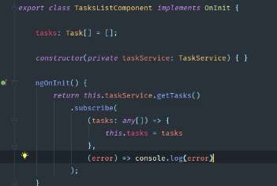  
   4. #### Create a () proxy-conf.json file:    
      * Set API to http://localhost:8080 so that the application can reach Spring Boot's endpoints.  
      * 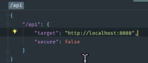  
   5. #### Change the "start" line in the package.json file:    
      * Pass in the newly created proxy.conf file to "ng serve".
      * *Going forward, start the frontend server by calling "npm start", instead of "ng serve".*  
      * 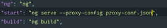  
      * 
Any time you are working with two local hosts like we are here, we need to add the above proxy.conf to proxy all requests over to Spring Boot. 

Adding localhost:8080 directly to the get task method instead of completing steps 4 & 5 will result in a "cross origin resource sharing" (CORS) issues.  
   

___  
   

3. ### Create a *saveTask(task: Task, checked: boolean) method.  
   * set task completed based on the value of the check box (whether checked or not).  
   * Similarly to the *getTasks()* method, we are going to use our http component to call out to our Spring Boot end point that takes in a body of 'task'.  
     * We pass the task object we receive in our tasklist.component.html (step 3 above) as the body of our post method.  
     * 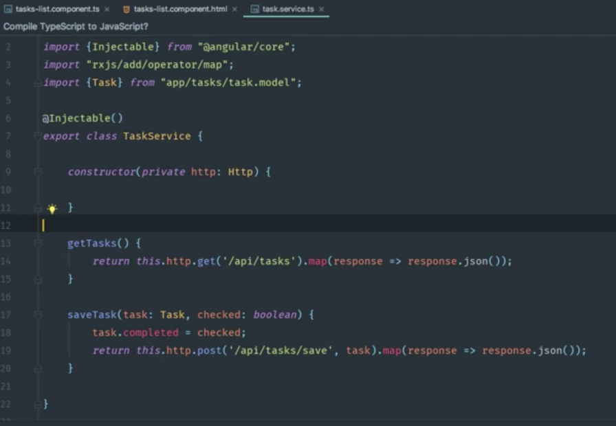  
   * In the tasks-list.component.ts file, write the logic for *onTaskChange Method()* to call *saveTask()* method in TaskService component when checkbox is checked as 'task completed'.  
     * 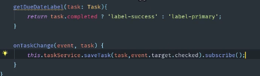  

You can now run the frontend and complete some tasks, thencheck the H2 console on localhost:8080 to confirm that the tasks are being completed on the server end as well.
___ 
4. ### Create an *addTask() method.  
   1. #### Create an *addTask(task: Task) method in task.Service.ts.  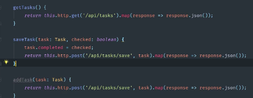  
   2. #### Update task.Model.ts so that the constructor no longer takes and id in its parameter.  
      * The id will be generated on the back-end through Spring Boot.  
      * 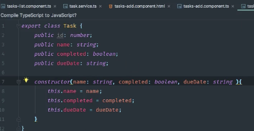  
   3. #### Add the following methods to tasks-add.component.ts file:  
      * **Constructor that takes a taskService object.**  
        * 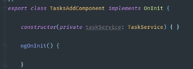  
      * **addTaskValue field and onTaskAdd(event) method.**  
        * Creates and returns a new task that takes a value, is marked as not completed, and inserts the current date.  
        * This method also clears the user input field where the task was entered and starts the process of adding the new task to the task list (remaining logic to add the new task to the list is in step v below).
        * 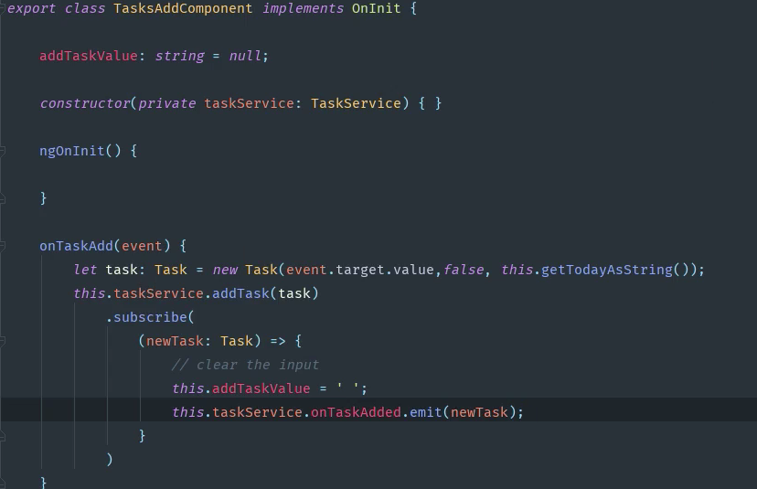  
   4. #### Go into the tasks-add.component.html file to add an eventListener and to set ngModel to the addTaskValue that we created in tasks-add.component.ts.  
      * 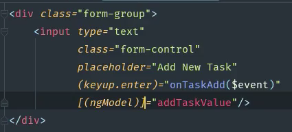  
   5. #### Have task list updated when new task is added without having to go back to the database.  
      * In task.service.ts, create onTaskAdded field and set it equal to new *EventEmitter\<Task>( );  
      * In tasks-list.component.ts, add *'this.taskService.onTaskAdded.subscribe(task: Task => this.tasks.push(task))'* to the end of the *ngOnInit()* method. 
      * 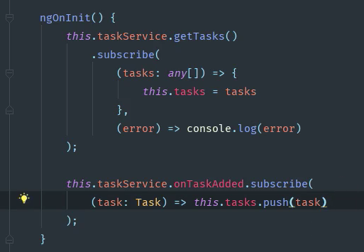  

   

___  

5. ## Connect Angular To Spring Boot:  
   * In the package.json file, add the following scripts:  
   1. "build": "ng build",  
   2. "postbuild": "npm run deploy",  
   3. "predeploy": "rimraf ../resources/static/ && mkdirp ../resources/static",  
      * this script essentially removes the static directory from the server's resources folder and recreates it (clears it out).
      * need to download rimraf and mkdirp packages from npmjs.com
      * enter 'npm install --save-dev rimraf' & 'npm install --save-dev mkdirp'
   4. "deploy": "copyfiles -f dist/** ../resources/static",  
      * this script copies the contents from our apps dist folder into the server's static folder.  
      * download the copyfiles package from mpmjs.com by entering 'npm install --save-dev copyfiles'  
      * 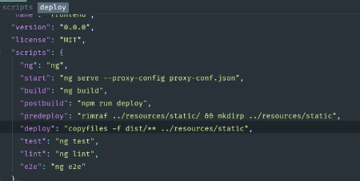  
The server and frontend apps can now both be run as a single app when the server is started.  

 

