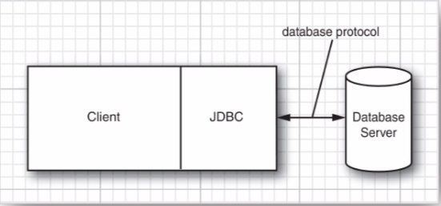
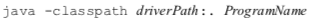
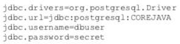
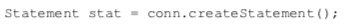
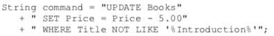
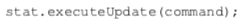
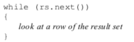

# Database Programming:  
##### The Design of the JDBC:  
###### JDBC Driver Types:  
The JDBC specification classifies drivers into the following types:  
* *Type 1 Driver* translates JDBC to ODBC and relies on an ODBC driver to communicate with the database. This type of driver was never intended for production use and Java 8 no longer provides the JDBC/ODBC bridge.  
* *Type 2 Driver* is written partly in Java and partly in native code; it communicates with the client API of a database. When using such a driver, you must install some platform specific code onto the client in addition to a Java library.  
* *Type 3 Driver* is a pure Java client library that uses a database-independent protocol to communicate database requests to a server component, which then translates the requests into a database-specific protocol. This simplifies deployment because the platform-specific code is located only on the server.  
* *Type 4 Driver* is a pure Java library that translates the JDBC requests directly to a database-specific protocol.  

Most database vendors supply either a *type 3* or *type 4* driver with their database. Furthermore, a number of third-party companies specialize in producing drivers with better standards conformance, support for more platforms, better performance, or, in some cases, simply better reliability than the drivers provided by the database vendors.  

###### Typical Uses of JDBC:  

The Old Two-Tier Model
  

The Current Three-Tier Model  
  

Currently, it is most common to have a three-tier model where the client application does not make database calls and instead calls on a middleware layer on the server that in turn makes database queries.  

The three-tier model is advantageous because it separates *visual presentation* (on the client) from the *business logic* (in the middle tier) and the raw data (in the database).  

###### The Structured Query Language:  
JDBC lets you communicate with the databases using SQL, which is the command language for essentially all modern relational databases.  

The JDBC package can be thought of as nothing more than an API for communicating SQL statements to databases. 

The most common SQL data types:
  

##### JDBC Configuration:  

###### Database URLS:  
When connecting to a database, you must use various database-specific parameters such as host names, port numbers, and database names.  

JDBC uses a syntax similar to that of ordinary URLS to describe data sources.

The below JDBC URLs specify a Derby database and a PostgresSQL database named *COREJAVA*:

  

The below general syntax is where a subprotocol selects the specific driver for connecting to the database:  

  
* The format for the *other stuff* parameter depends on the subprotocol used. You need to look up your vendor's documentation for the specific format.  

###### Driver JAR Files:  
You need to obtain the JAR file in which the driver for your database is located. The PostgresSQL drivers are available at:

http://jdbc.postgresql.org.  

Include the driver JAR file on the class path when running a program that accesses the database (You don't need the JAE file for compiling.)  

When you launch programs from the command line, simply use the command:

  

###### Starting the Database:  
The database server needs to be started before you can connect to it. The details depend on your database.  

###### Registering the Driver Class:  
Many JDBC JAR files (such as the Derby driver included with JAVA SE 8) automatically register the driver class.  

A JAR file can automatically register the driver class if it contains a file  . You can simply unzip your driver's JAE file to check.  

If you driver's JAR file doesn't support automatic registration, you need to find out the name of the JDBC driver classes used by your vendor.

Typical driver names are:  
  

There are two ways to register the driver with the *DriverManager*. One way is to load the driver class in your Java program. For example:  

  
This statement causes the driver class to be loaded, thereby executing a static initializer that registers the driver.

Alternatively, you can set the *jdbc.drivers* property with a command-line argument, such as:  

  
Or your application can set the system property with a call such as:  

  

###### Connecting to the Database:  
In your Java program, open a database connection like this:  
  
The *getConnection* method returns a *Connection* object.

To connect to the database, you will need to have a user name and password. Here is an example using PostgresSQL:  
  

###### Working with JDBC Statements:  
To execute a SQL statement, you first create a *Statement* object. To create statement objects, use the *Connection* object that you obtained from the call to *DriverManager.getConnection*.  
  

Next, place the statement you want to execute into a string, For example:  

  
Then call the *executeUpdate* method of the *Statement* interface:

 
The *executeUpdate* method returns a count of the rows that were affected by the SQL statement, or zero for statements that do not return a row count.

The *executeUpdate* method can execute actions such as *INSERT*, *UPDATE*, and *DELETE*, as well as data definition statements such as *CREATE TABLE* and *DROP TABLE*. However, you need to use the *executeQuery* method to execute *SELECT* queries.  
* The *executeUpdate* method returns a count of the rows that were affected by the SQL, or zero for statements that do not return a row count.  
* When you execute a query, you are interested in the result. The *executeQuery* object returns an object of type *ResultSet* that you can use to walk through the result one row at a time.  

  

There is also a catch-all *execute* statement to execute arbitrary SQL statements that usually only used for queries that a user supplies interactively.  

A loop through a result set looks like this:  
  
* The order of the rows in a result is completely arbitrary. Unless you specify the order with an *ORDER BY* clause, you should not attach any significance to the row order.

There are accessors for various *types*, such as *getString* and *getDouble*. Each accessor has two forms: One takes a numeric argument and the other takes a string argument.  
* When you supply a numeric argument, you refer to the column in the result set with that name. For example, *rs.getDouble("Price") returns the value of the column with the label *Price*.  
* Using the numeric argument is a bit more efficient, but the string arguments make the coe easier to read and maintain.  

###### java.sql.Connection  
*Statement createStatement( );*  
* creates a *Statement* object that can be used to execute SQL queries and updates without parameters.  

*void close( );*  
*immediately closes the current connection and the JDBC resources that it created.  

###### java.sql.Statement  
*ResultSet executeQuery(String sqlQuery)*  
* executes the SQL statement given in the string and returns a *ResultSet* object to view the query result.  

*int executeUpdate (String sqlStatement);*  
*long executeLargeUpdate (String sqlStatement);*  
* executes the SQL *INSERT, UPDATE* or *DELETE* statement specified by the string. Also executes the Data Definition Language (DDL) statements such as *CREATE TABLE*  

*boolean execute(String sqlStatement);*  
* executes the SQL statement specified by the string. Returns true if the first result is a result set, or false otherwise.  

*ResultSet getResultSet ();*  
* returns the result set of the preceding query statement. Call this method only once per executed statement.  

*int getUpdateCount( );*  
*long getLargeUpdate Count( );*  
* returns the number of rows affected by the preceding update statement. Call this method only once per executed statement.  

*void close( );*  
closes this statement object and its associated result set.  

*boolean isClosed( );*  
* returns true of theis statement is closed.  

*void closeOnCompletion( );*  
* causes this statement to be closed once all of its result sets have been closed.  

###### java.sql.ResultSet:  
*boolean next();*  
* makes the current row in the result set move forward by one. Returns false after the last row. You must call this method to advance to the first row.  

*Xxx get Xxx(int columnNumber);*  
*Xxx get Xxx(String columnLabel);*  
*\<T> T getObject(int columnIndex, Class\<T> type);*  
*\<T> T getObject(String columnLabel, Class\<T> type);*  
*void updateObject(int columnIndex, Objec x, SQLType targetSqlType);*  
*void updateObject(String columnLabel, Object x, SQLType target SqlType);*  
* returns or updates the value of the colmn with the given clomn index or label, converted to the specified type. The column label is the label specified in the SQL *AS* clause or the column name if *AS* is not used.  
*int findColumn (String columnName);*  
* gives the column index associated with a column name.  

*void close( );*  
* immediately closes the current result set.  

*boolean isClosed( );*  
    * returns true if the statement is closed.  

##### Managing Connections, Statements, and Result Sets:  
Everey *Connection* object can create one or more *Statement* objects. You can use the same *Statement* object for multiple unreleated commands and queries, but a statement has, at most, one open result set. If you issue multiple queries whose results you analyze concurrently, you need multiple *Statement* objects.  
* In practice, you should not fuss with multiple concurrent result sets. If the result sets are related, you should be able to issue a combined query and analyze a single result.  
* It is much more effiient to let the database combine queries that it is for a Java program to iterate through multiple result sets.  
* When you are doing using a *ResultSet, Statement,* or *Connection*, you should call the *close* method immediately because these objects use large data structures that draw on the finite resources of the database server.  
  * The *close* method of a *Statement* object automatically closes the associated result set if the statement has an open result set. Similarly the *close* method of the *Connection* class closes all statements of the connection.  

##### Analyzing SQL Exceptions:  
Each *SQLException* has a chain of *SQLExtion* objects that are retrieved with the *getNextException* method. 
* This exception chain is in addition to the "cause" chain of *Throwable*  objects that every exception has.  
* The *iterator( )* metho yields an *Iterator\<Throwable>* that iterates through both chains:  
  * It starts by going through the cause chain of the first *SQLException*, then moves on to the next *SQLException*, and so on by simply using a *for* loop:  

  

You can call *getSQLState* and *getErrorCode* on an *SQLException* to analyze it further. 
* The first method yields a string that is standardized by either X/Open or SQL:2003.  

The SQL exceptions are organized into an inheritance tree:  
  

###### java.sql.SQLException:  
*SQLException getNextException();*  
* gets the next SQL exception chained to this one.  

*Iterator\<Throwable>;*  
* gets an iterator that yields the chained SQL exceptions and their causes.  

*String getSQLState()*  
* gets the "SQL state" - a standardized error code.  

*int getErrorCode( );* 
* gets the vendor-specific erro code.  

###### java.sql.SQLWarning:  
*SQLWarning getNextWarning();*  
returns the next warning chained to this one.  

###### java.sql.Connection:  
###### java.sql.Statement:  
###### java.sql.ResultSet:  
*SQLWarning getWarning()*  
* returns the first of the pending warnings.  

###### java.sql.DataTruncation:  
*boolean getParameter( );*  
* returns true if the data truncation applies to a parameter, false if it applies to a cloumn.  

*int getIndex();*  
* returns the index of the truncated parameter or column.  

*int getDataSize();*  
* returns the number of bytes that should have been transferred.  

*int getTransactionSize();*  
* returns the number of bytes that were actually transferred.

