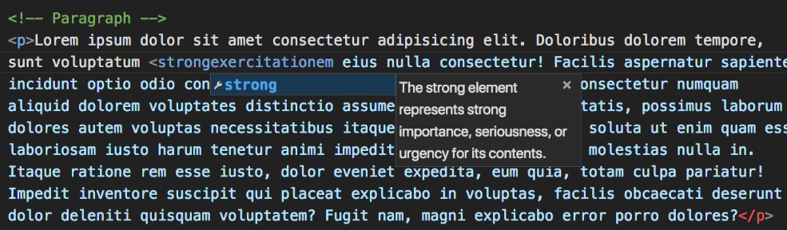

# HTML Topography  

<h1>Heading 1</h1>  

\<h1>Heading 1\</h1>
<h2>Heading 2</h2>    

\<h2>Heading 2\</h2>  

<h3>Heading 3</h3>  

\<h3>Heading 3\</h3>  

<h4>Heading 4</h4>  

\<h4>Heading 4\</h4>  

<h5>Heading 5</h5>  

\<h5>Heading 5\</h5>  

<h6>Heading 6</h6>  

\<h6>Heading 6\</h6>  

## Add Lorem Ipsum:  
* Inside a paragraph tag, enter "Lorem followed by the number of words without a space.
  

## Bold Tag:  
<strong> Bold </strong>  
\<strong>bold\</strong>  

*  The strong tag replaced the \<b> tag bc strong just means it's meant to stand out, not be bold. It defaults to bold, but it really relies on CSS to determine it's look.

## Emphasis/Italic:  
<em>emphasis/italic</em>  
\<em>emphais/italic\</em>  

## Line Break:  
\   

## Horizontal Rule:  
\
  

