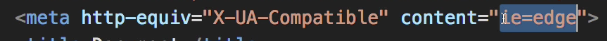
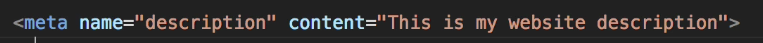
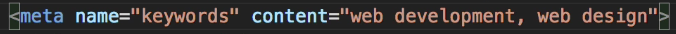
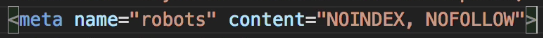

# HTML Notes:

#### Shortcut To Build Basic HTML Page Structure:  
Enter "!" "Enter" to create the following template:  

  

#### Meta Tags:  
  

This tag allows for responsive design.  

  
This tag specifies browser compatibility.  

##### Search Engine Meta Tags:  

  
This tag is the description that shows up in search results. Also somewhat helps with optimization, but not as much weight nowadays.

  
This tag used to hold a lot of weight for SEO, but doesn't carry much weight anymore.  

  
This tag prevents search engines from indexing or following the content on your site.  

