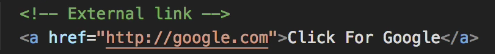
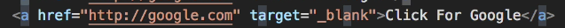
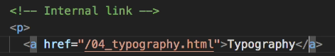
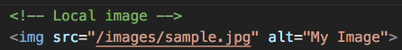
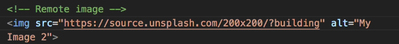

# Links, Images, * Attributes:  

## Links:  
* \<a href="http://google.com">Click For Google\</a>  

  

  

## Open Link In New Page:  
*   \<a href="http://google.com" target="_blank">Click For Google\</a>

## Internal Links:  
* Start link with a slash.  

  

## Link to Display Local Image on Page:  
  

## Link to Display Remote Image on Page:  
  

