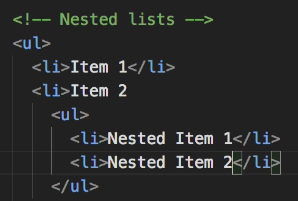

# Lists & Tables:  

## Unordered Lists:  
* Create an unordered list tag \<ul> and then insert all list items \<li>Item 1\</li> \<li>Item 2\</li>, etc inside the \<ul> tags.  
  
  

## Ordered Lists:  
  

## Nested Lists:  
  
  

## Tables:  
* tables have a head, heading, body, data, and possibly a footer.

  
  

