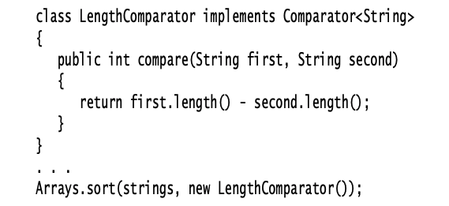

# Comparator Interface:  
If you want to sort strings by length instead of the default dictionary order, you pass a Comparator object to the sort method:  

  

* the *compare* method is called right away. Instead, the *sort* method keeps calling the *compare* method, rearranging the elements if they are out of order, until the array is sorted.  
* you give the *sort* method a snippet of code needed to compare the elements, and that code is implemented into the rest of the sorting logic

