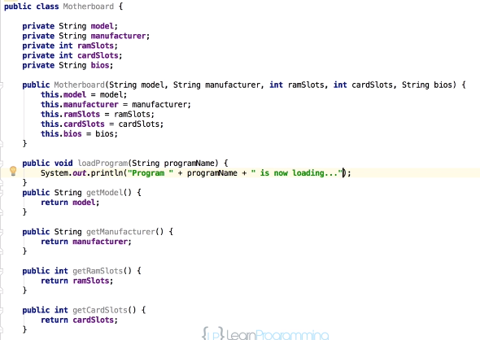
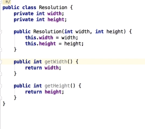
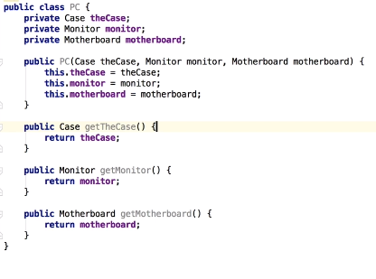
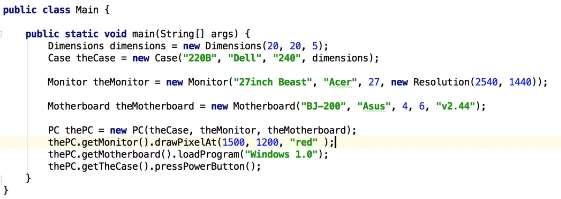
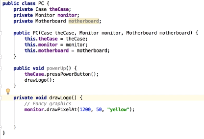

### Composition/Abstraction Example:  
In this example, we are going to build a computer using *composition*.
* Our computer/PC will consist of the following objects:
  * Motherboard Class
  * Monitor Class
  * Resolution Class
  * Case Class
  * Dimensions Class
  * PC Class

###### Motherboard Class:  
 

###### Monitor Class:  
  

###### Resolution Class:  

###### Case Class:

###### Dimensions Class:   

###### PC Class:
  
In our PC class, we make a constructor that takes in each of the objects from the other classes that we created, as well as create private instance fields for each class.  
* Our PC is an object composed completely of other objects.
* Because the instance of the objects were passed to our PC through the constructor, all new instances of the PC class will automatically have access to the methods of each class because new instances of each class will need to be created at the same time.
* Because of this access, we are able to create getters in the PC class for each object so that instances of the PC can call the individual objects

###### Building A Computer In The Main Method:  
In the below screenshot, we  create an instance of PC component so that we can create a new instance of the PC. The PC has access to the methods of each object that it is composed of by calling the public getters we created in the PC class and chaining the methods from the particular object's class we want to invoke. 
* In this example, when we turn on a computer, we have to call three separate methods via the getters we created for each class:
  1. *drawPixalAt( )*: to draw the logo that comes on when the computer starts.
  2. *loadProgram( )*: to load Windows.
  3. *pressPowerButton( )*: to turn on the case.

   
###### Removing the Public Getters In The PC Class:
In the below screenshot, we remove the public getters in the PC class and instead create methods that call the component objects' method's directly.
* We then create a *powerUp( )* method that calls all the methods involved with turning on the computer.
  * The steps involve with powering up the computer are now hidden inside the PC class and the code is simplified.
  * The concept of hiding all but the relevant data about an object in order to reduce complexity and increase efficiency is called **Abstraction**.
 
 

