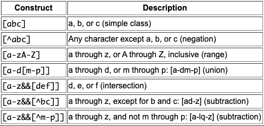
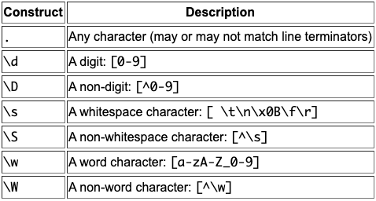
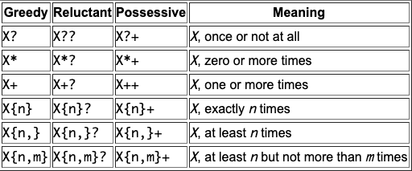
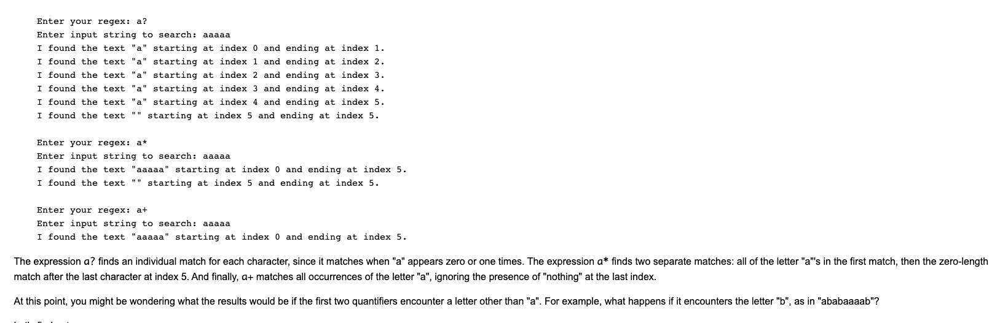
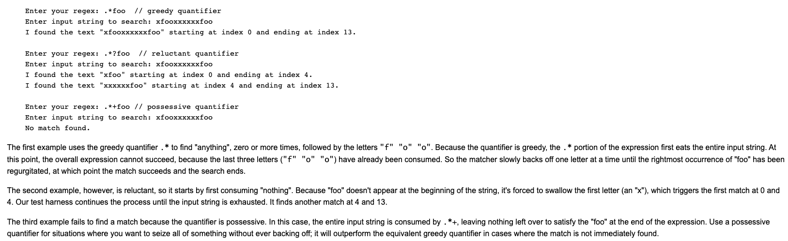
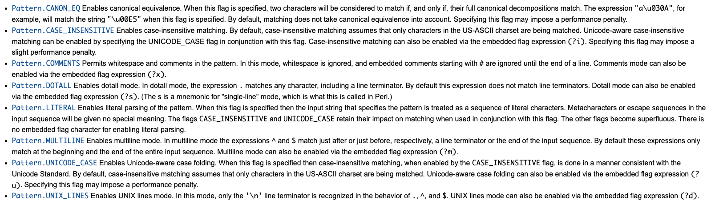

# Regular Expressions:  
###### Pattern Object:  
A Patter Object is a compiled representation of a regular expression.  
* The Pattern class does not provide any public construtors.  
* To create a pattern, you must first invoke one of its *public static compile* mthods, which will then return a *Pattern* object.  
* These methods accept a regular expression as the first argument.  

###### Matcher Object:  
A Matcher Object is the engine that interprets the pattern and performs match operations against an input string.  
* Like the Pattern class, Matcher does not define any public constructors.  
* You obtain a Matcher object by invoking the matcher method ona Pattern object.  

##### String Literals:  
The most basic form of pattern matching supported by this API is the match of a string literal.  

##### Metacharacters:  
The metacharacters supported by this API are: <([{\^-=$!|]})?*+.])>  
###### Two Ways To Force A Metacharacter To Be Treated As An Ordinary Character:  
1. precede the metacharacter with a backslash, or  
2. enclose it within \Q(which starts the quote) and \E (which ends it).  
   * When using this technique, the \Q and \E can be placed at any location within the expression, provided that the \Q comes first.  

##### Character Classes:  
  
* The left hand column specifies the regular expression contructs, while the right-hand column describes the conditions under which each construct will match.  
  * The word "class" in the phrase "character class" does not refer to a .class file. In the context of regular expressions, a *character class* is a set of charaters enclosed within square brackets.  
  * It specifies the characters that will successfully match a single character from a given input string.  

###### Simple Classes:  
The most basic form of a character class is to simply place a set of characters side-by-side within square brackets.  
* The regular expression [bcr]at will match the words "bat", "cat", or "rat".  
 ###### Negation:  
 To match all characters except those listed, insert the "^" metacharacter at the beginning of the character class.  
 * [^bc]at will not match "bat" or "cat", but will match "hat" or "rat".  

###### Ranges:  
To specify a range, simply insert the "-" metacharacter between the first and last character to be matched, such as [1-5] or [a-h].  
* You can also place different ranges beside each other within the class to further expand the match possibilities. 
  * For example, [a-zA-Z] will match any letter of the alphabet whether or not it is uppercase or lowercase.  

###### Unions:  
*Unions* can be used to create a single character class comprised of two or more separate character classes.  
* To create a union, simply nest one class inside the other, such as [0-4[6-8]].  
  * This particular union creates a single character class that matches the numbers 0, 1, 2, 3, 4, 6, 7, and 8.   

###### Intersections:  
To create a single character class matching only the characters common to all of its nested lasses, use &&, as in [0-9&&[345]].  
* This particular intersection creates a single character class matching only the numbers common to both character classes: 3, 4, and 5.  

###### Subtraction:  
You can use *subtraction* to negate one or more nested character classes, such as [0-9&&[^345]].  
* This example creates a single character class that matches everything from 0 to 9, *except* the numbers 3, 4, and 5.  

##### Predefined Character Classes:  
The Pattern API contains a number of useful *predefined character classes*, which offer convenient shorthands for commonly used regular expressions:  
  

##### Quantifiers:  
Quantifiers allow you to specify the number of occurrences to match against.  
  

###### Zero-Length Matches:  
*a?* and *a** both allow for zero occurrences of the letter *a*. 
  

###### Match A Pattern Exactly *n* Number Of Times:  
* Simply specify the number inside a set of braces:  
  * a{3} looks for "aaa".  
  * "aaaaaaaaa" will find "aaa" will find three sets of "aaa".  

###### Find a Pattern That Appears At Least *n* Times:  
* Enter your regex as a{3,}.  
* This same string finds all "aaaaaaaaa" as one match.  

###### Specify An Upper Limit On The Number Of Occurrences:  
* Add a number inside the braces:  
  * a{3,6} will look for "a" at least three times, but no more than six times in a row.  
  
###### Capture Groups And Character Classes With Quantifiers:  
* (dog){3} searches for "dog" three times in a row.  
* [abc]{3} searche for any of these three letters occurring three times in a row.  
  
##### Differences Among Greedy, Reluctant, And Possessive Quantifiers:  
###### Greedy Quantifiers:  
Greedy quantifiers are considered "greedy" because they fore the matcher to read in, or eat, the entire input string prior to attempting the first match.  
* If the first match attempt(the entire input string) fails, the matcher backs off the input string by one character and tries again, repeating the process until a mtach is found or there are no more characters left to back off from.  
* Depending on the quantifier, the last thing it will try matching against is 1 or 0 characters.  

###### Reluctant Quantifiers:  
Reluctant quantifiers take the opposite approach to greed quantifiers. They start at the beginning of the input string, then reluctantly eat one character at a time looking for a match. 
* The last thing they try is the entrie input string.  

###### Possessive Quantifiers:  
Possessive quantifiers always eat the entire input string, trying once (and only once) for a match.
* Unlike greedy quantifiers, possessive quantifiers never back off, even if doing so would allow the overall match to succeed.  
  

##### Capturing Groups:  
*Capturing groups* are a way to treat multiple characters as a single unit. 
* They are created by placing the characters to be grouped inside a set of parentheses.
* For example, the regex (dog) creates a single group containing the letters "d" "o" and "g".  
###### Numbering:  
Capturing groups are numbered by counting their opening parentheses from left to right. In the expression ((A)(B(C))), for example, there are four such groups:  
1. ((A)(B(C)))
2. (A)
3. (B(C))
4. (C)  

To find out how many groups are present in the expression, call the **groupCount method** on a matcher object.  
* The groupCount method returns an int showing the number of capturing groups present in the matcher's pattern.  
  * In this example, the groupCount method would return the number 4.  
* It's important to understand how groups are numbered because some *Matcher* methods accept an int specifying a particular group number as a parameter.  
  * public int start(int group): returns the start index of the subsequence captured by the given group during the previous match operation.  
  * public int end(int group): returns the index of the last character, plus one, of the subsequence captured by the given group during the previous match operation.
  * public String group (int group): returns the input subsequence captured by the given group during the previous match operation.  
###### Backreferences:  
The section of the input string matching the capturing group(s) is saved in memory for later recall via *backreference*. A backreference is specified in the regex as a backslash(\) followed by a digit indicating the number of the group to be recalled.  
* For example, the expression (\d\d) defines one capturing group matching two digits in a row, which can be recalled later in the expression via the backreference \1.  
* To match any 2 digits, followed by the exact same two digits, you would use (\d\d)\1 as the regular expression.  
 

##### Boundary Matchers:  
You can make your matches more precise by specifying the location a match occurs within a particular input string.
* For example, maybe your interested in finding a particular word, but only if it appears at the beginning or end of a line.  

The following table lists and explains all the boundary matchers.  
  

To check if a pattern begins and ends on a word boundary (as opposed to a substring within a longer string), just us \b on either side.  
 

To match the expression on a non-word boundary, us \B instead:  
  

To require the match to occur only at the end of the previous match use \G:  
  
* Here the second example finds only one match, because the second occurrence of "dog" does not start at the end of the previous match.  

##### Methods Of The Pattern Class:  
###### Creating A Pattern With Flags:  
The Pattern class defines an alternat compile method that accepts a set of flags affecting the way the pattern is matched. The flags parameter is a bit mask that may include any of the following public static fields:  

