# Streams:  
###### From Iterating To Stream Operations:  
When you process a collection, you usually iterate over its elements and do some work with each of them.  

A Stream seems superficially similar to a collection, allowing you to transform and retrieve data. But there are significant differences:  
1. A stream does not store its elements. They may be stored in an underlying collection or generated on demand.  
2. Stream operations don't mutate their source. For example, the filter method does not remove elements from a stream, but yields a new stream in which they are not present.  
3. Stream operations are *lazy* when posible. This means they are not executed until their result is needed. For example, if you only ask for the first five long words instad of all, the filter method will stop filtering after the fifth match. As a consequence, you can even have infinite streams.  

The stream pipeline of operation is set up in three stages:  
1. Create a stream.
2. Specify the *intermediate operations* for transforming the initial stream into others, possibly in multiple steps.
3. Apply a *terminal operation* to produce a result. This operation forces the execution of the lazy operations that precede it. Afterwards, the stream can no longer be used.  

###### java.util.stream.Stream<T>:  
* Stream<T> filter(Predicate<? super T> p)  
  * yields a stream containing all elements of this stream fulfilling p.  
* long count()  
  * yields the number of elements of this stram. This is a terminal operation.

###### java.util.Collections<E>:  
* default Stream<E> stream()  
* default Stream<E> parallelStream()  
  * yields a sequential or parallel stream of the elements in this collection.  

#### Stream Creation:  
###### Creating Streams From Arrays:  
* Stream<String> words = Stream.of(contents.split("\\PL+"));  // split returns a String[] array  
  * this method has a varargs parameter, so you can construct a stream from any number of arguments:  
  * Stream<String> song = Stream.of("gently", "down", "the", "stream");  
* Use Arrays.stream(array, from, to) to make a stream from a part of an array.  
* To make a stream with no elements, us the static Stream.empty method:
  * Stream<String> silence = Stream.empty();  // Generic type <String> is inferred; same as Stream.<String>empty()  

###### Creating Infinite Streams:  
* The *generate* method takes a function with no arguments(or, technically, an object of the *Supplier<T>* interface*).  
  * Whenever a stream value is needed, that function is called to produce a value. You can get a stream of constant values by:  
    * Stream<String> echos = Stream.generate(() -> "Echo");  
  * or a stream of random numbers by:  
    * Stream<Double> randoms = Stream.generate(Math::random);  
* To produce sequences such as 0 1 2 3 . . ., use the *iterate* method instead.
  * It takes a "seed" value and a function (technically, a UnaryOperator<T>) and repeatedly applies the function to the previous result. For example:  
    * Stream<BigInteger> integers = Stream.iterate(BigInteger.ZERO, n -> n.add(BigInteger.One));
      * The first element in the sequence is the seed BigInteger.ZERO. The second element is f(seed) which yields 1 (as a big integer). The next element is f(f(seed)) which yields 2, and so on.  
* To produce a finite stream instead, add a predicate that specifies when the iteration should finish:  
* 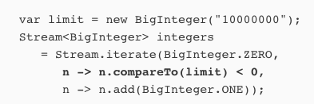  
  * As soon as the predicate rejects an iteratively generated value, the stream ends.  
* The *Stream.ofNullable* method makes a really short stream from an object.  
  * The stream has length 0 if the object is *null* or length 1 otherwise, containing just the object.  
    * This is motly useful in conjunction with  *flatMap*.  

Its very important that you don't modify the collection backing a stream while carrying out a stream operation. Remember that streams don't collect their data -the data is always in a separate collection. If you modify that collection, the outcome of the stream operations becomes undefined.  
* The JDK documentation refers to this requirement as *noninterference*.  
* To be exact, since intermediate stream operations are lazy, it is possible to mutate the collection up to the point where the terminal operation executes.  

###### java.util.Spliterators  
* static <T> Spliterators<T> spliteratorUnknownSize(Iterator<? extends T> iterator, int characteristics)  
  * turns an iterator into a splittable iterator of unknown size with the given characteristics (a bit pattern containing constants such as Spliterator.ORDERED).  
  
###### java.util.Arrays  
* static <T> Stream<T> stream(T[] array, int startInclusive, int endExclusive)  
  * yields a stream whose elements are the specified range of the array.  

###### java.util.regex.Pattern  
* Stream <String> splitAsStream(CharSequence input)  
  * yields a stream whose elements are the parts of the input that are deliminated by this pattern.  

###### java.util.function.Suppliers<T>  
* T get()  
  * supplies a value.  

##### The *Filter*, *Map*, and *FlatMap* Methods:  
A stream transformation produces a stream whose elements are derived from those of another stream.
###### Filter:
The filter transformation yields a new stream with those elements that match a certain condition. 

Here, we transform a stream of strings into another stream containing only long words:  
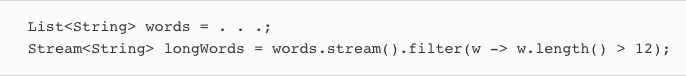  
* The argument of filter is a Predicate<T> - that is, a function from T to boolean.  

###### Map:  
Often, you want to transform the values in a stream in some way. Use the map method and pass the function that carries out the transformation.  

For example, you can transform all words to lowercase like this:  
  
* Here, we used map with a method reference. Often, you will use a lambda expression instead:  
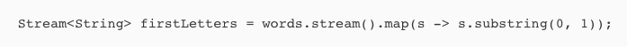  
* The resulting stream contains the first letter of each word.  
  * When you use *map*, a function is applied to each element, and the result is a new stream with the results.

Now, suppose you have a function that returns not just one value but a stream of values:  
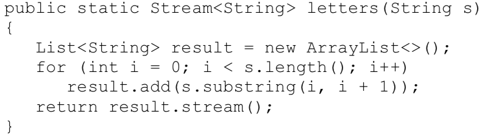  
* For example *letters("boat")* is the stream *["b", "o", "a", "t"]*. 
  * You can implement this method much more elegantly using the *IntStream.range* method.  

Suppose you map the *letters* method on a stream of strings"  
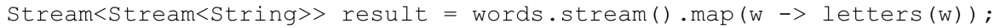  
* You will get a stream like this:  
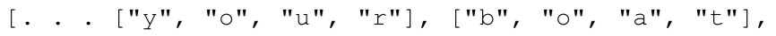  

You can flatten it out to a stream of letters using the **flatMap** method instead of *map* method:  

[. . . "y", "o", "u", "r", "b", "o", "a", "t", . . .]]

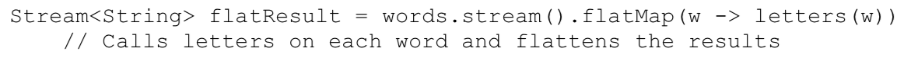  
* You will find a *flatMap* method in classes other than streams. It is a general concept in computer science.  

##### Extracting Substreams and Concatenating Streams:  
###### Stream.limit(n):  
The call stream.limit(n) returns a new stream that ends after *n* elements (or when the original stream ends, if it is shorter).  
* This method is particularly useful for cutting infinite streams down to size. For example:  
  
* This yields a stream with 100 random numbers.

###### Stream.skip(n):  
The call stream.skip(n) does the exact oposit of stream.limit(n). It discards the first *n* elements.
* This method is handy when splitting text into words since, due to the way the *split* method works, the first elment is an unwanted empty string.
* We can make it going away by calling *skip*.  
   

###### Stream.concat(String a, String b);  
  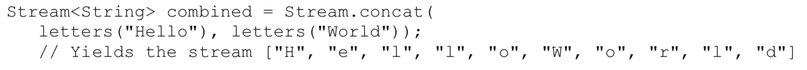  
* Of course the first stream should not be infinite - otherwise the second will never get a chance.  

##### Other Stream Transformations:  
###### .distinct:  
The *distinct* method returns a stream that yields elements from the original stream, in the same order, except that duplicates are suppressed.  
  

###### Sorting Streams:  
There are several variations of the *sorted* method. 
1. One works for streams of *Comparable* elements.
2. The other accepts a *Comparator*.

Here we sort strings so that the longest ones come first:  
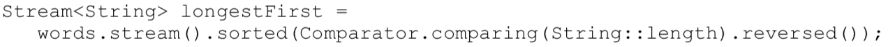  

As with all stream transformations, the *sorted* method yields a new stream whose elements are the elements of the original stream in sorted order.  

##### Peek Method:  
The *peek* method yields another stream with the same elements as the original, but a function is invoked every time an element is retrieved.
* This is handy for debugging: 

  
* In this example, a message is printed when an element is actually accessed. This way you can verify that the infinite stream returned by *iterate* is processed lazily.  

##### Simple Reductions:  
Reductions are *terminal operations*. They reduce the stream to a non-stream value that can be used in your program.  

###### Count Method:  
returns the number of elements in a stream.  

###### Max and Min Methods:  
returns the largest or smallest value.
* There is a twist - these methods return an *Optional<T>* value that either wraps the answer or indicates that there is non (because the stream happened to be empty)
* The *Optional* type is a good way of indicating a missing return value.  
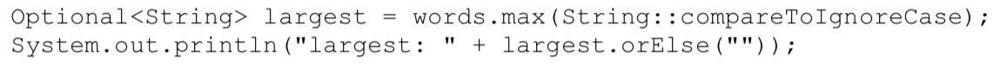  

###### findFirst Method:  
returns the first value in a nonempty collection.  
* It is often useful when combined with *filter*.

For example, here we find the first word that starts with the letter "Q", if it exists:  
  

###### findAny Method:
Finds any match the stream finds.  
  

###### anyMatch Method:  
Used to determine if there is a match in the stream. Returns a boolean.  
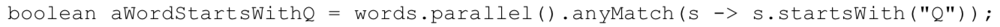 

###### allMatch & noneMatch:  
Returns true if all or no elements match a predicate.  

##### The Optional Type:  
An *Optional<T>* object is a wrapper for either an object of type *T* or no object. In the former case, we say that the value is *present*.  
* The *Optional<T>* type is intended as a safer alternative for a reference of type *T* that either refers to an object or is *null*.

##### How to Work With Optional Values:  
The key to using *Optional* effectively is to use a method that either *produces an alternative* if the value is not present, or *consumes the value* only if it is present.  

Skipped over the Optional Section for now...  

#####Collecting Results:  
When you are done with a stream, you can call the *forEach* method to apply a function to each element:  
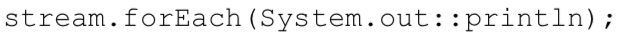 

###### toArray:  
You can call *toArray* to get an array of the stream elements.  
* Since it is not possible to create a generic array at runtime, the expression *stream.toArray()* returns an *Object[]* array.  
* If you want an array of the correct type, pass in the array constructor:  
  

###### collect Method:  
The .collect method takes an instance of the *Collector* interface and provides a large number of factory methods for common collectors.  
* To stream into a list or set, simply call:  

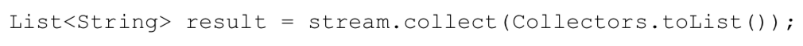   
or:  

  

If you want to control which kind of set you get, use a call similar to the following:  

    

If you want to collect all strings in a stream by concatenating them, you can call:  
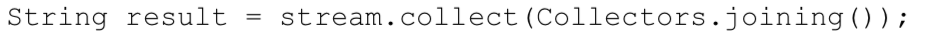  

If you want a delimiter between the elements pass it to the joining method and insert a delimiter:  
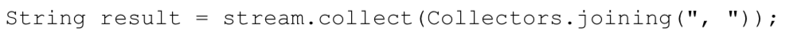  

If your stream contains objects other than strings, you need to first convert them to strings before joining them:
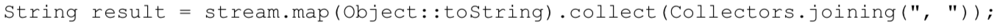   

Reduce the stream results to a sum, average, maximum, or minimum by using one of the *summarizing(Int|Long|Double)* methods.  
* These methods take a function that maps the stream objects to a number and yield a result of type *(Int|Long|Double)SummaryStistics*, simultaneously computing the sum, count, minimum, and maximum.  
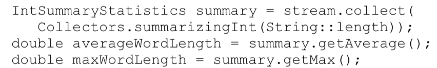  

##### Collecting Into Maps:  
The *Collectors.toMap& method has two function arguments that produce the map's keys and values:  
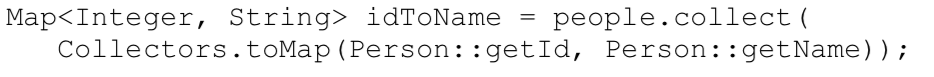  
* In the common case when the values should be the actual elements, use *Function.identity()* for the second parameter:
  
  
* If there is more than one element with the same key, there is a conflict, and the collector will throw an *IllegalStateException*. You can override that behavior by supplying a third function argument that resolves the conflict and determines the value for the key, given the existing and the new value.  
  * Your function could return the existing value, the new value, or a combination of them.  

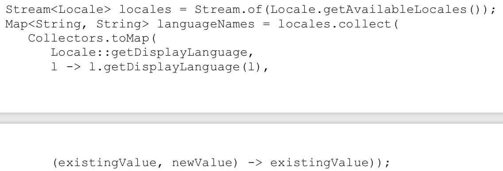  
  *   We don't care that the same language might occur twice (for example, German in Germany and in Switzerland), so we just keep the first entry.  

Suppose we want to know all the languages in a given country. Then we need a *Map<String, Set<String>>*. 
* For example, the value for "*Switzerland*" is the set *[French, German, Italian]*  
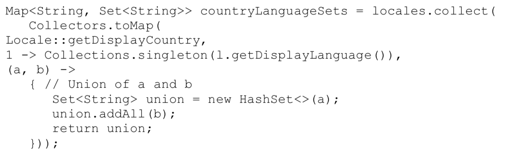  

##### Grouping and Partitioning:  
The process of grouping countries in the last example was a bit tedious. Forming groups of values with the same characteristics is very common and the **groupBy** method supports it directly.  

When the classifier function is a predicate function(that is, a function returning a *boolean* value), the stream elements are partitioned into two lists: those where the function returns *true* and the complement.  This can be accomplished by using the **partitioningBy** method instead of the *groupBy* method.  

##### Downstream Collectors:  
The *groupingBy* method yields a map whose values are lists. If you want to proceess those lists in some way, supply a "downstream collector".  

Several collectors are provided for reducing grouped elements to numbers:  
* *counting* produces a count of the collect elements. For example, counting counts how many locales there are for each country:  

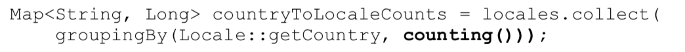  

* *summing(Int|Long|Double)* takes a function argument, applies the function ot the downstream elements, and produces their sum. For example, summing computes the sum of populations per state in a stream of cities:  

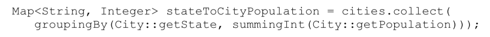  

* *maxBy* and *minBy* take a comparator and produce maximum and minum of the downstream elements. For example, *maxBy* produces the largest city per state:  

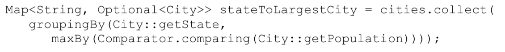  

* The *mapping* method yeilds a collector that applies a function to downstream results and passes the function values to yet another collector. For example, here we group cities by state. Within each state, we produce the names of the cities and reduce by the maximum length:  

  

Composing collectors is a powerful approach, but it can also lead to very convoluted expressions. Their best use is with *groupingBy* or *partitioningBy* to process the "downstream" map values. Otherwise, simply apply methods such as *map, reudce, count, max* or *min* directly on streams.

##### Reducing Operations:  
The *reduce* method is a general mechanism for computing a value from a stream. The simplest form take a binary function and keeps applying it, starting with the first two elements. Its easy to explain this if the function is the sum:  

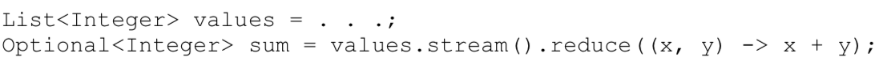  
* In this case, the *reduce* method computes V0 + V1 + V2 + . . ., where Vi are the stream of elements.
* The method returns an *Optional* because there is no valid result if the stream is empty.  

##### Primitive Type Streams:  
The stream library has specialized types *IntStream, *LongStream*, and *DoubleStream* that store primitive values directly, without using wrappers.  
* If you want to store *short*, *char*, *byte*, and *boolean*, use an *IntStream*, and for *float*, use a *DoubleStream*.  

To create an *IntStream*, call the *IntStream.of* and *Arrays.stream* methods:  
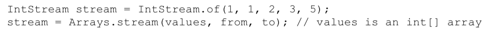  

