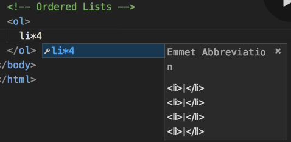

# Visual Studio Code Shortcuts:  

## Copy Entire Line to Line Below:  
Shift Option Down Arrow  

## Jump to Left or Right One Word at a Time:  
Option Left or Right Arrow  

## Move Entire Line (Not Copying):  
Option Up or Down Arrow  

## Specify The Number of List Items:  
  

  

